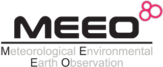
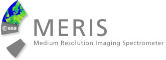
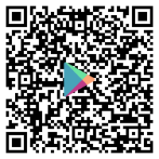
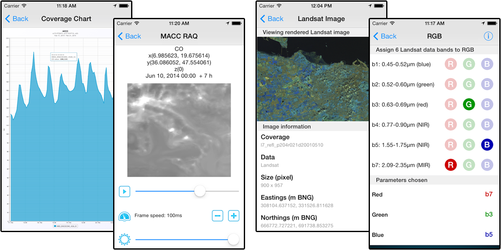
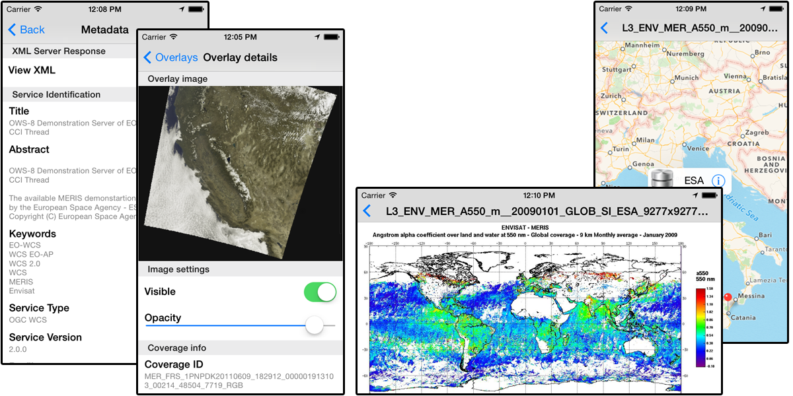

********************************
EarthServer SG Mobile (v. 2.6.2) 
********************************

============
About
============
.. _PROJECT-URL:  http://www.earthserver.eu/
.. _SG-URL: https://earthserver-sg.consorzio-cometa.it/
.. _PLAY: https://play.google.com/store/apps/details?id=it.infn.ct.earthserverSGmobile
.. _ITUNES: https://itunes.apple.com/us/app/earthserver-sg-mobile/id740603213?ls=1&mt=8

  

**EarthServer SG Mobile** is a mobile application developed in the contest of `EartServer project <PROJECT-URL_>`_, Android and iOS versions are available from `Google Play <PLAY_>`_ and the `Apple Store <ITUNES_>`_. The main aim of this mobile app is to provide an easy way to access data services that make use of the OpenSource Geospatial Catalogue (OSGC) standards such as WCS and WMS as well as provide data repository access containing metadata. 

The **EarthServer SG Mobile** app allows users to interact with the following four services:

1. Climate Data Services provided by the Meteorological Environmental Earth Observation (`MEEO <www.meeo.it/>`_) WCS server

2. Geological Data Service provided by the British Geological Survey (`BGS <http://www.bgs.ac.uk/>`_) WCS server

   
3. A generic mobile client for WCS and WMS services

4. A repository browser of atmospheric data coming from the ESA MERIS spectrometer
   

   
Be aware that the access to some of the services provided by EarthServer Science Gateway Mobile, requires federated credentials issued by an Identity Provider. If the organisation you belong to has an Identity Provider, proceed with the download; otherwise, you can first get federated credentials registering to the "open" Identity Provider, which belongs to the GrIDP federation
   
============
Installation
============

To install EarthServer SG Mobile on your devices simply download the app from the store

|PLAY-STORE| |PLAY-STORE| 

.. |PLAY-STORE| image:: images/google_play_icon.png
   :align: middle 
   :target: PLAY_
   :alt: EarthServer SG Mobile logo
   :scale: 100%

or scan one of the following QR code 

|ANDROID-QR| |IOS-QR|

    
.. |IOS-QR| image:: images/appstore_qr.png
   :align: middle
   :alt: EarthServer SG Mobile app store
   :scale: 10%

============
Usage
============

Once the application is installed on you mobile appliance, you can access the four services from the main screen and navigate through a well defined path to exploit the application features. 

   
Some 
   

   
============
References
============

============
Support
============

